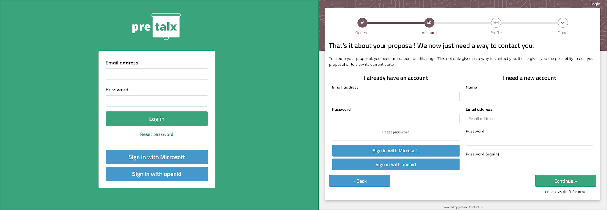

# Single Sign-On (SSO) Plugin for pretalx

This is a plugin for [pretalx](https://github.com/pretalx/pretalx). It provides an integration with [Python Social Auth](https://github.com/python-social-auth/social-core), allowing users to log in with third-party identity providers.

It is of fork of [pretalx-social-auth](https://github.com/adamskrz/pretalx-social-auth), which itself is originally based on [social_django](https://github.com/python-social-auth/social-app-django) from the Python Social Auth project, but with the removal of deprecated features and the addition of pretalx-specific settings.

## Screenshots



## Configuration

In your `pretalx.cfg` file, add all the auth backends you need as a comma-separated list. Then, add the backend-specific settings to the `[plugin:pretalx_sso]` section. You can find the backend name and required settings in the [python-social-auth documentation](https://python-social-auth.readthedocs.io/en/latest/backends/index.html).

Example:

```ini
[authentication]
additional_auth_backends=social_core.backends.microsoft.MicrosoftOAuth2,social_core.backends.open_id.OpenIdAuth

[plugin:pretalx_sso]
SOCIAL_AUTH_MICROSOFT_GRAPH_KEY=xxxxx-xxxxx-xxxxx-xxxxx-xxxxxxxxxx
SOCIAL_AUTH_MICROSOFT_GRAPH_SECRET=xxxxxxxxxxxxxxxxxxxxxxxxxx
TRUST_IDP_EMAILS=False
```

Due to how Social Auth is configured with API keys in `settings.py`, **this doesn't support configuring providers (backends) on a per-event basis**. This means particular care should be taken where custom event domains are in use, as some providers require a different API key per domain (or adding valid redirect URLs).

The original author initially evaluated using [django-allauth](https://github.com/pennersr/django-allauth), which supports configuring providers in the database on a per-site basis. However, because it replaces the entire authentication model, it would have been significantly harder to implement as a pretalx plugin.

## Email-based Account Linking

When a user attempts to log in via SSO for the first time, the plugin checks if a user with the same email address already exists in the database. The behavior in this situation is controlled by the **TRUST_IDP_EMAILS** global setting.

### TRUST_IDP_EMAILS Setting

This setting controls whether the operator trusts all configured identity providers (IDPs) to authenticate users:

- **Disabled (Default - Secure)**: Users logging in via SSO for the first time will be rejected if an account with that email already exists. The user will be shown an error message instructing them to log in with their existing credentials first, then connect their social account from their profile settings.

- **Enabled (Trust IDPs)**: Users logging in via SSO for the first time will be automatically linked to existing accounts with the same email address. This provides a seamless experience when users already have an account and want to use SSO.

### Security Considerations

The default is **disabled** for security reasons:

- It prevents unauthorized access if an attacker compromises an email account and creates a social login with a provider
- It ensures explicit user consent before linking accounts
- It's safer when you cannot fully trust all configured identity providers

Enable this setting only when:

- You fully trust all configured identity providers to properly verify email addresses
- Your IDPs enforce email verification
- You want to prioritize user convenience over strict account separation

## License

This plugin is licensed under the BSD-3-Clause License. See the [LICENSE](LICENSE) file for details.

## Contributing

Contributions are welcome! Please open an issue or submit a pull request on GitHub. Check the [CONTRIBUTING](CONTRIBUTING.md) guidelines for more information on how to contribute.

## Acknowledgements

Thanks a lot to Adam for the original implementation of this plugin, which served as the basis for this fork!
